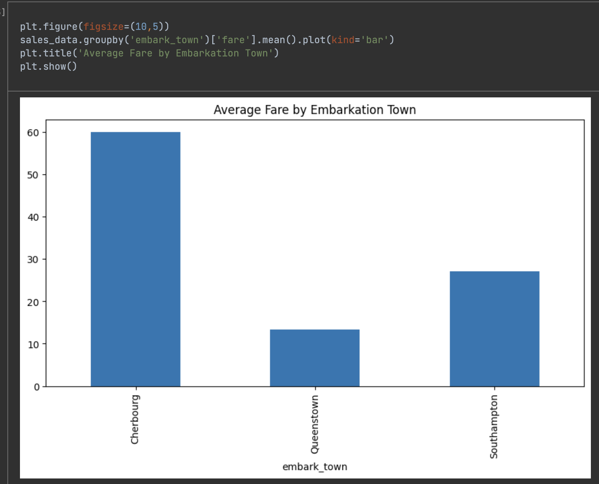

# 📊 Sales Data Visualization Dashboard



## Project Overview
Interactive dashboard analyzing sales patterns using:
- Time series trends
- Product performance metrics
- Regional distribution analysis
- Feature correlations

## Key Features
✔️ **Interactive Filtering**: Dynamic region selector using Plotly  
✔️ **Automated Aggregation**: Real-time revenue calculations  
✔️ **Publication-Ready Visuals**: Custom styling with Matplotlib/Seaborn  

## Technologies Used
- Python 3
- Pandas (Data Cleaning)
- Matplotlib/Seaborn (Static Visuals)
- Plotly (Interactive Charts)
- Jupyter Notebook

## How to Run
1. Clone repository:
   ```bash
   git clone https://github.com/Kartik0211/Data-visualization-Dashboard.git
